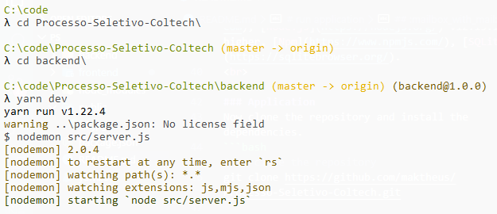

<h1 align="center">
  
    <br>
</h1>

<h4 align="center">
  A application to archive your repostory 
</h4>

<p align="center">


 
</p> 


<p align="center">
  <a href="#rocket-built-with">Built with</a>&nbsp;|
  <a href="#information_source-how-to-run">How to run</a>&nbsp;&nbsp;&nbsp;|&nbsp;&nbsp;&nbsp;
  <a href="#page_facing_up-license">Licence</a>&nbsp;&nbsp;&nbsp;|&nbsp;&nbsp;&nbsp;
  <a href="#mailbox_with_mail-get-in-touch">Get in touch</a>
</p>
<br><br>

## :rocket: Built with

This project was developed with the following technologies:

-  [Node.js](https://nodejs.org/)
-  [React.js](https://pt-br.reactjs.org/)
-  [Insomnia](https://insomnia.rest/)
-  [MoongoDB](https://www.mongodb.com/cloud/atlas)
-  [VS Code](https://code.visualstudio.com/)
-  [Axios](https://github.com/axios/axios)

## :information_source: How to run

### Requirements
To run the app, you will need [Git](https://git-scm.com), [Node.js](https://nodejs.org/) v12.13.1 or higher, [Npm](https://www.npmjs.com/), [SQLite3](https://sqlitebrowser.org/).
<br>

### Application
Now clone the repository and install the dependencies.
```bash
# to clone the repository
git clone https://github.com/maktheus/Processo-Seletivo-Coltech.git

# go into the folder
cd Processo-Seletivo-Coltech/backend

#install the backend dependencies
npm install
#Start backend
npm run dev
```
<p>With yarn example:</p>


# run application
```bash
# go into the folder

cd Processo-Seletivo-Coltech/frontend

#install the frontend dependencies

npm install

#Start backend

npm run start
```

<p>With yarn example:</p>


## :page_facing_up: License

This project is under the MIT license. 

## :mailbox_with_mail: Get in touch!

[ LinkedIn ](https://www.linkedin.com/in/matheus-serr%C3%A3o-uchoa-164992195/)

Email: maktheus@gmail.com


---

Made with :coffee: and ♥ by Uchôa.
